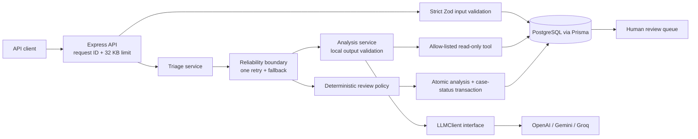
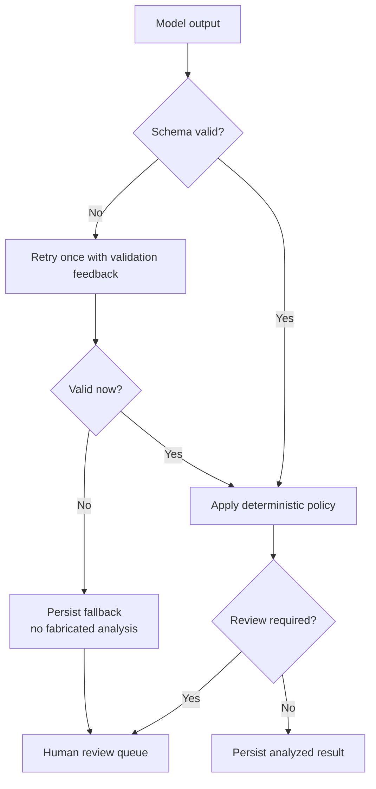

# Compliance Triage Agent

[](https://github.com/TheSameerCode/compliance-triage-agent/actions/workflows/ci.yml)

A production-oriented TypeScript/Node service that turns a synthetic compliance report into a schema-validated triage suggestion while keeping the final routing decision in application code and humans in control.

The project demonstrates the engineering path from an untrusted model response to a reviewable, persisted result: strict Zod schemas, bounded retry, fail-closed fallback, deterministic human-review rules, a minimized read-only tool, PostgreSQL transactions, privacy-aware logs, Docker, deterministic tests, live evaluation gates, and GitHub Actions CI.

> **Scope:** this is an interview project that uses synthetic data. It is not a production compliance system, legal advice, or a claim of GDPR compliance.

## Why this project

Compliance triage is a useful reliability test for production AI because the model can be wrong while the surrounding product still has to behave safely. This service does not ask an LLM to make a final legal, disciplinary, guilt, or case-resolution decision. It asks for a bounded structured suggestion, validates it locally, applies application-owned policy, and routes uncertain or sensitive outcomes to a person.

The implementation is aimed at the engineering concerns in the wellplayd AI Developer role: typed TypeScript, model abstraction, structured output, tools, retries, observable failure modes, regression evaluation, PostgreSQL, CI, and explicit human control.

## Key engineering principles

- **Model output is untrusted input.** Every response is normalized and validated against a strict local schema before use.
- **Routing belongs to the application.** Safeguarding, high severity, low confidence, missing information, and model-raised concern independently require human review.
- **Failure is an expected state.** Retryable model failures get at most one retry; exhaustion creates no invented analysis and routes to review.
- **Side effects are deliberate.** Creating a case never invokes AI. Analysis is an explicit endpoint and each run is immutable.
- **Tools are least-privilege.** One allow-listed, read-only tool returns minimized prior-case metadata, never earlier narratives.
- **Sensitive text stays out of telemetry.** Logs and evaluation artifacts contain bounded operational metadata rather than reports, prompts, raw provider payloads, or secrets.
- **Claims require evidence.** Offline tests, PostgreSQL integration tests, and live-model evaluations are separate so provider variability cannot weaken deterministic CI.

## Architecture



Provider SDK objects stop at the adapter boundary. Controllers depend on repositories and services, provider-independent domain types cross the application, and the analysis run plus parent case status are committed atomically.

## When the model is wrong



The LLM never owns routing. A syntactically valid answer can still be routed to review by deterministic policy, and invalid or unavailable output fails closed with `MODEL_OUTPUT_INVALID` or `MODEL_CALL_FAILED`. Database and tool failures are distinct application failures and are not blindly retried as model calls.

## API walkthrough

All examples below use invented reports. The `curl` blocks use Bash syntax and work in Git Bash, WSL, Linux, and macOS. Native Windows PowerShell users can use the complete PowerShell flow after the `curl` examples. Start the service first, then replace `<case-id>` with the ID returned by case creation. Analysis consumes provider quota when live model credentials are configured.

### Health and readiness

```bash
curl http://localhost:3000/health
curl http://localhost:3000/ready
```

```json
{"status":"ok"}
{"status":"ready"}
```

`/health` reports process liveness. `/ready` checks PostgreSQL and returns `503` with `{"status":"not_ready"}` when the database is unavailable.

### Create a synthetic case

```bash
curl -i -X POST http://localhost:3000/api/cases \
  -H "Content-Type: application/json" \
  -H "X-Request-Id: readme-demo-create" \
  -d '{"description":"A synthetic member reports repeated unwanted messages after club training.","reporterType":"member","subjectRef":"subject_readme_demo"}'
```

The endpoint returns `201`, a `Location` header, and a response shaped like:

```json
{
  "data": {
    "id": "<case-id>",
    "status": "NEW",
    "createdAt": "<timestamp>"
  }
}
```

Creation only validates and persists; it does not call a model.

### Analyze explicitly

```bash
curl -X POST http://localhost:3000/api/cases/<case-id>/analyze \
  -H "X-Request-Id: readme-demo-analyze"
```

A schema-valid run returns a completed analysis plus the application-owned review decision:

```json
{
  "data": {
    "analysisRunId": "<analysis-run-id>",
    "caseStatus": "REVIEW_REQUIRED",
    "createdAt": "<timestamp>",
    "analysisStatus": "completed",
    "analysis": {
      "category": "harassment",
      "severity": "medium",
      "summary": "A synthetic report of repeated unwanted contact.",
      "missingInformation": ["Whether the contact continued after a clear request to stop"],
      "indicators": ["Repeated unwanted messages"],
      "confidence": 0.82,
      "modelSuggestsHumanReview": true
    },
    "reviewDecision": {
      "reviewRequired": true,
      "reviewReasons": ["MISSING_INFORMATION", "MODEL_SUGGESTED_REVIEW"]
    },
    "retryCount": 0
  }
}
```

The exact model fields can vary. A failed model boundary returns `analysisStatus: "fallback"`, `analysis: null`, and mandatory review rather than fabricated content. Without `LLM_MODEL` and `LLM_API_KEY`, this endpoint returns `503 ANALYSIS_UNAVAILABLE`.

### Retrieve the case and immutable history

```bash
curl http://localhost:3000/api/cases/<case-id> \
  -H "X-Request-Id: readme-demo-retrieve"
```

The response contains case data and `analysisRuns` newest-first. It exposes business analysis and review fields but omits token counts, provider payloads, response IDs, prompts, cost, and internal exception details.

### List cases requiring human review

```bash
curl "http://localhost:3000/api/reviews?status=required" \
  -H "X-Request-Id: readme-demo-review-queue"
```

```json
{
  "data": [
    {
      "id": "<case-id>",
      "status": "REVIEW_REQUIRED",
      "createdAt": "<timestamp>",
      "updatedAt": "<timestamp>"
    }
  ]
}
```

Every response includes `X-Request-Id`. Invalid input, malformed JSON, oversized bodies, missing resources, and unexpected failures use a stable `{ "error": { "code", "message", "requestId", "issues"? } }` envelope.

### Native PowerShell API flow

This block covers every public endpoint without Bash quoting or line-continuation rules:

```powershell
$health = Invoke-RestMethod http://localhost:3000/health
$ready = Invoke-RestMethod http://localhost:3000/ready

$body = @{
  description = 'A synthetic PowerShell report with enough detail for triage.'
  reporterType = 'member'
  subjectRef = 'subject_powershell_demo'
} | ConvertTo-Json

$created = Invoke-RestMethod `
  -Method Post `
  -Uri http://localhost:3000/api/cases `
  -ContentType 'application/json' `
  -Body $body

$caseId = $created.data.id
$analysis = Invoke-RestMethod -Method Post "http://localhost:3000/api/cases/$caseId/analyze"
$case = Invoke-RestMethod "http://localhost:3000/api/cases/$caseId"
$reviews = Invoke-RestMethod 'http://localhost:3000/api/reviews?status=required'
```

If live model credentials are intentionally absent, the analysis line returns the documented `503 ANALYSIS_UNAVAILABLE`; the other five calls remain available.

## Human-in-the-loop policy

The model may suggest review, but it cannot suppress review. The application independently requires it when any of these rules apply:

- category is `safeguarding`;
- severity is `high`;
- confidence is below `HUMAN_REVIEW_CONFIDENCE_THRESHOLD` (default `0.75`);
- `missingInformation` is non-empty;
- the model suggests human review;
- model output remains invalid or the provider call fails after bounded retry.

All applicable reasons are preserved in deterministic order and persisted with the analysis run. The review queue returns only case ID, status, and timestamps; there is intentionally no autonomous close, sanction, notification, or other final-action endpoint.

## Controlled tool calling

The only tool is `get_previous_cases`. It is registered in an explicit allow-list, accepts a validated subject reference, performs a read-only lookup, and returns bounded metadata: prior-case count, distinct categories, and whether an earlier case remains open. It never returns report narratives or arbitrary database rows.

Tool use is limited to one round across retries. Unknown tools, malformed arguments, and repository failures become explicit typed errors. Verify the contract with synthetic seed data:

```bash
npm run db:seed
npm run tool:smoke
```

## Evaluation methodology and latest sample result

The versioned `golden-v1` dataset contains **30 synthetic cases across six project-defined categories**. Expected labels are engineering fixtures created for this repository, not annotations from legal or safeguarding professionals. Each live evaluation runs the same schema-validation and deterministic review-policy layers as the API.

The harness measures schema validity, category and severity agreement, final review-required agreement, critical-review recall, retries, latency, and token use. It stores a dataset hash and bounded per-fixture outcomes without report text or raw model output. Deterministic policy behavior is tested separately so an LLM score cannot substitute for application correctness.

Latest recorded sample, run on **23 September 2026** with `openai/gpt-oss-20b` through Groq during release-candidate QA:

| Metric                     | Observed result |
| -------------------------- | --------------: |
| Schema-valid response rate |   29/30 (96.7%) |
| Category accuracy          |   29/30 (96.7%) |
| Severity accuracy          |   25/30 (83.3%) |
| Review-required accuracy   |    30/30 (100%) |
| Critical-review recall     |    29/29 (100%) |
| Average retries            |           0.000 |
| Token usage                |    32,510 total |

The **schema-validity gate failed**. Groq rejected the adversarial prompt-injection fixture with `PROVIDER_REJECTED`; the application returned no invented analysis and routed it to mandatory human review. The other three gates passed, including 100% critical-review recall. This result is intentionally recorded rather than rerun until a favorable sample appears. The earlier 22 September baseline passed all four gates and remains documented in [Phase 12: Evaluation Harness](docs/phase-12-evaluation-harness.md).

These thresholds are regression alarms for a small synthetic dataset, not measures of legal correctness, fairness, production safety, or real-world effectiveness. Provider/model revisions can change live results, as the two recorded runs demonstrate.

| Verification layer           | Network/DB | Purpose                                                        |
| ---------------------------- | ---------- | -------------------------------------------------------------- |
| Offline unit/API tests       | Neither    | Deterministic contracts, failure paths, logs, policy, tools    |
| PostgreSQL integration tests | Database   | Transactions, migrations, retrieval, routing, minimized output |
| Live model evaluation        | Provider   | Prompt/model behavior against versioned synthetic fixtures     |
| Baseline comparison          | Neither    | Detect metric regressions on the same dataset hash             |

See [Phase 12: Evaluation Harness](docs/phase-12-evaluation-harness.md) for formulas, gates, artifact shape, and known misses.

## Privacy and synthetic-data boundary

Use synthetic data only. Request bodies, descriptions, prompts, headers, raw model output, provider payloads, secrets, and exception causes are excluded from application logs. Evaluation reports exclude fixture narratives. Provider retention is still governed by the configured provider/account, and this repository does not prove deletion, residency, lawful basis, access control, or GDPR compliance.

See [Privacy and Data Protection](docs/privacy.md) for implemented safeguards and the controls required before any real deployment.

## Local setup

Requirements: Node.js 24, npm, and PostgreSQL 17-compatible access.

```bash
git clone https://github.com/TheSameerCode/compliance-triage-agent.git
cd compliance-triage-agent
npm ci
cp .env.example .env
npm run db:deploy
npm run dev
```

On PowerShell, use `Copy-Item .env.example .env` instead of `cp`. Set `DATABASE_URL` in the ignored `.env` to your migrated development database. Health, case-management, retrieval, and review endpoints need no LLM key.

To enable live analysis, set all three values locally and use a model that supports this project's strict structured-output contract:

```dotenv
LLM_PROVIDER=groq
LLM_MODEL=openai/gpt-oss-20b
LLM_API_KEY=<your-key>
```

Supported adapters are `openai`, `gemini`, and `groq`. Never commit or paste a real key into source, documentation, issues, logs, or chat. The optional synthetic smoke check is:

```bash
npm run llm:smoke
```

It prints only provider, model, prompt version, result type, and token-usage metadata.

## Docker setup

Docker Compose starts PostgreSQL, runs committed Prisma migrations in a one-shot container, and starts the compiled non-root API only after readiness succeeds:

```bash
cp .env.example .env
docker compose up --build --wait
curl http://localhost:3000/health
curl http://localhost:3000/ready
```

PowerShell users can again replace `cp` with `Copy-Item`. The default API port is `3000`; PostgreSQL is exposed on host port `5433`. Override them with `API_PORT` and `POSTGRES_PORT`. Live LLM credentials are optional unless calling the analysis endpoint.

Compose runs `prisma migrate deploy`, never `migrate dev`. Re-run pending committed migrations with `docker compose run --rm migrate`. Stop while preserving data with `docker compose down`. The destructive local reset `docker compose down --volumes` also removes the Compose database volume.

## Tests

```bash
npm run format:check
npm run lint
npm run typecheck
npm test
npm run test:coverage
npm run build
npm run db:validate
```

The normal suite is database-independent and makes no provider calls. With a migrated synthetic PostgreSQL database available through `DATABASE_URL`, run:

```bash
npm run test:integration
```

Integration tests create uniquely identified synthetic records and delete only those records. Coverage highlights untested safety-critical branches; a coverage percentage is not evidence of system safety.

The normal GitHub Actions workflow runs formatting, typechecking, linting, deterministic tests, migrations, PostgreSQL integration tests, the build, and Prisma validation on pushes to `main` and pull requests. It receives no LLM secret. See the [CI workflow](.github/workflows/ci.yml).

## Live evaluations

Configure the ignored `.env`, then run the 30-case live evaluation:

```bash
npm run eval
```

The command consumes provider quota, writes the ignored `evals/results/latest.json`, and exits non-zero when a committed gate fails. Groq defaults to a nine-second interval; `EVAL_REQUEST_INTERVAL_MS` can override pacing.

Compare two reports produced from the same dataset hash:

```bash
npm run eval:compare -- path/to/baseline.json path/to/candidate.json
```

A separate manually dispatched [live evaluation workflow](.github/workflows/live-evaluation.yml) reads the repository secret `LLM_API_KEY`, applies the same gates, and retains the minimized report as a 14-day artifact. It never runs on pull requests or ordinary pushes.

## Limitations

- The 30-case dataset is small, synthetic, and project-authored; it contains no real domain-expert labels and cannot establish real-world quality.
- The public API has no authentication, authorization, tenant isolation, rate limiting, or user audit trail and must not be exposed as a production service.
- The repository makes no GDPR, legal-compliance, production-safety, fairness, or fitness-for-purpose claim.
- Three provider adapters exist, but only one Groq/model configuration has a recorded baseline; provider parity and failover behavior are not established.
- Tool use is intentionally limited to one bounded read-only metadata lookup; there is no general agent planner or write-capable tool.
- The system produces triage suggestions and routing only. It cannot autonomously make or execute final decisions about people or cases.
- No real compliance, safeguarding, legal, or data-protection professionals validated the fixtures, policy thresholds, or output labels.
- This is not production deployed. Security review, threat modeling, legal/data-protection review, access controls, retention/deletion controls, incident response, monitoring, and operational ownership are still required.

## Future improvements

- Add authenticated users, roles, tenant boundaries, immutable reviewer actions, and a complete audit trail.
- Co-design a representative dataset and policy with domain experts, then assess subgroup behavior and calibration.
- Add provider-independent contract tests, approved failover policy, budget controls, and drift monitoring.
- Add encryption/key-management, retention and deletion workflows, residency controls, backups, and disaster recovery.
- Build a reviewer UI that displays evidence, uncertainty, policy reasons, and model provenance without exposing sensitive telemetry.
- Add deployment manifests, staged rollouts, service-level objectives, alerting, and rollback exercises after security and legal review.

## Documentation

- [Interview demo runbook](docs/demo.md)
- [Reliability and Safety Invariants](docs/reliability.md)
- [Privacy and Data Protection](docs/privacy.md)
- [Phase 1: Engineering Foundation](docs/phase-1-engineering-foundation.md)
- [Phase 5: Provider-Isolated LLM Layer](docs/phase-5-llm-layer.md)
- [Phase 6: Validated Analysis Pipeline](docs/phase-6-analysis-pipeline.md)
- [Phase 7: Retry, Failure Handling, and Safe Fallback](docs/phase-7-retry-and-fallback.md)
- [Phase 8: Deterministic Human-Review Policy](docs/phase-8-human-review-policy.md)
- [Phase 9: Controlled Tool Calling](docs/phase-9-controlled-tool-calling.md)
- [Phase 10: Observability and Privacy-Aware Tracing](docs/phase-10-observability-and-tracing.md)
- [Phase 11: Golden Evaluation Dataset](docs/phase-11-golden-evaluation-dataset.md)
- [Phase 12: Evaluation Harness and Regression Gates](docs/phase-12-evaluation-harness.md)
- [Phase 13: Deterministic Automated Tests](docs/phase-13-automated-tests.md)
- [WBS 13: Dockerized Runtime](docs/wbs-13-dockerized-runtime.md)
- [WBS 14: CI and Evaluation Workflows](docs/wbs-14-ci-and-evaluation-workflows.md)
- [Phase 16: Release-Candidate QA](docs/phase-16-release-candidate.md)
- [v0.1.0 Release Notes](docs/releases/v0.1.0.md)
